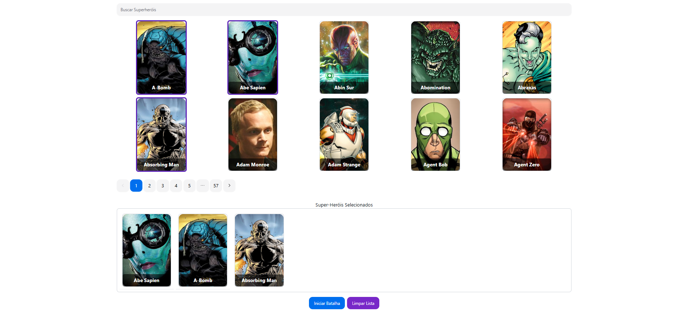

# Desafio Frontend



## Descrição

O Superhero Battle App é um aplicativo para gerenciar super-heróis, permitindo aos usuários selecionar heróis, visualizar uma lista, realizar batalhas e exibir o vencedor em um modal. O projeto utiliza Vite para construção e desenvolvimento, React para a interface do usuário e TypeScript para garantir uma tipagem robusta.

## Funcionalidades

- **Lista de Super-Heróis**: Exibe uma lista de super-heróis com suporte para pesquisa e seleção.
- **Seleção de Super-Heróis**: Permite a seleção de super-heróis para uma batalha.
- **Batalha**: Realiza uma batalha entre os super-heróis selecionados e exibe o vencedor.
- **Paginação**: Navega entre páginas de super-heróis.
- **Modal do Vencedor**: Mostra um modal com o super-herói vencedor da batalha.

## Componentes Principais

- **`SuperherosList`**: Componente que exibe a lista de super-heróis com pesquisa e seleção.
- **`SelectedSuperheros`**: Componente que mostra os super-heróis selecionados e permite batalhas ou limpar a seleção.
- **`WinnerModal`**: Modal que exibe o super-herói vencedor.
- **`Loading`**: Componente de carregamento exibido durante a obtenção dos dados.

## Hooks Personalizados

- **`useSuperheroList`**: Gerencia o estado da lista de super-heróis, seleção, paginação e lógica de batalha.

## Instalação

1. Clone o repositório:

   ```bash
   git clone https://github.com/JonasDias10/desafio-frontend.git
   ```

2. Navegue até o diretório do projeto:

   ```bash
   cd desafio-frontend
   ```

3. Instale as dependências:

   ```bash
   npm install
   ```

4. Inicie o servidor de desenvolvimento:
   ```bash
   npm run dev
   ```

## Tecnologias

- **Vite**
- **React**
- **TypeScript**
- **Tailwind CSS**
- **NextUI**
- **Axios**

---

#### **Autor: Jonas Dias | [Social Media](https://jonas-dias.netlify.app/) | Obrigado**
